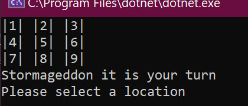
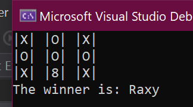

# Lab04-ClassesAndObjects
*by Harry Cogswell*
A two-player, tic-tac-toe Console Program, written in C#

----

## Description
This is a Console Program, written in C#, that will play a game of tic-tac-toe, accepting
input from two players, alternating turns. It will then decide a winner, or if there is
none by the time the 3x3 board fills up, it will declare a draw!

---

### Getting Started
Clone this repository to your local machine.

```
$ git clone https://github.com/HCoggers/Lab04-ClassesAndObjects.git
```

### To run the program from Visual Studio:
Select ```File``` -> ```Open``` -> ```Project/Solution```

Next navigate to the location you cloned the Repository.

Navigate to the ```StarterCode/Lab04-ClassesAndObjects``` directory.

Then select and open ```Lab04-ClassesAndObjects.sln```

Now, from Visual studio you can press the green play button or ```Shift-f5``` on your keyboard to run the Program.

---

### Visuals





---
